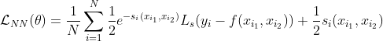

# Aleatoric uncertainty extension to Pyramid Stereo Matching Network (PSMNET)

PSMNET basic Network is extented with aleatoric uncertainty according to [What Uncertainties Do We Need in Bayesian Deep Learning for Computer Vision?
](https://arxiv.org/pdf/1703.04977.pdf).

Uncertainty values are predicted in a seperate branch, which branchs out from cost volume:

Loss function was changed to:

